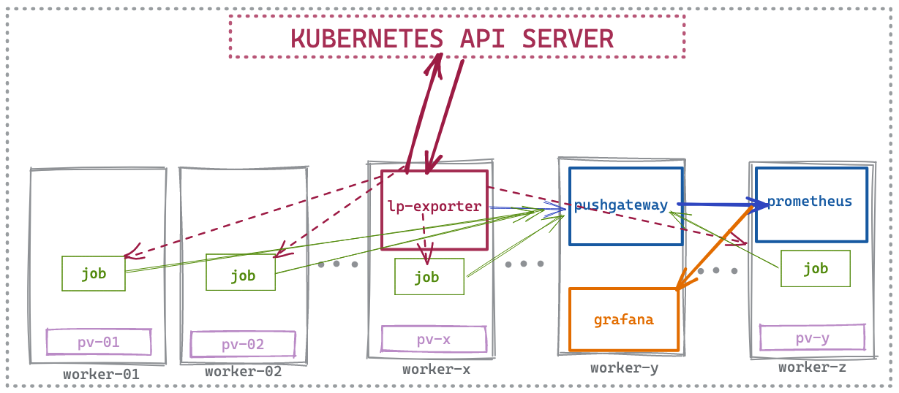
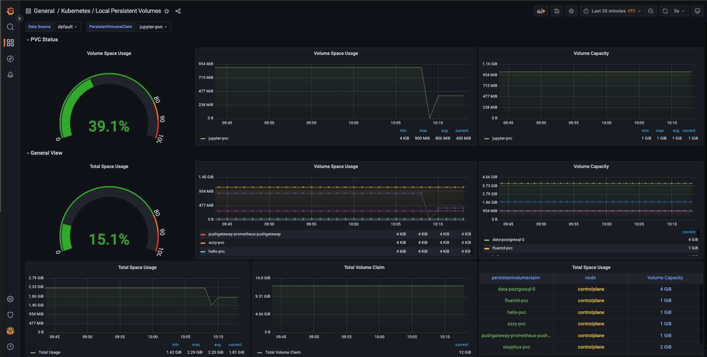
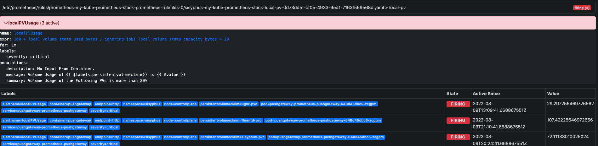

# Local Path Provisioner Metrics Exporter

## What is it?
This is a simple metrics exporter solution for the [local-path-provisioner](https://github.com/rancher/local-path-provisioner) or any `hostPath` storage solution. It generates `local_volume_stats_capacity_bytes` and `local_volume_stats_used_bytes` metrics for the persistent volumes `(PV)`  based on the `hostPath` solution.

## Why?

Since the local-path-provisioner is a `hostPath` solution, it does not have any metrics for the PV such `kubelet_volume_stats_used_bytes` or `kubelet_volume_stats_capacity_bytes`. Some use cases and warnings for this solution are listed on the [kubernetes documentation](https://kubernetes.io/docs/concepts/storage/volumes/#hostpath). But since local-path-provisioner provides a dynamic provisioning solution it is a good alternative for development and testing environments in which data loss can be tolerated.

Another alternative is `local` typed ones, but there are some limitations to use `local` type volumes too as stated in [sig-storage-local-static-provisioner best practices](https://github.com/kubernetes-sigs/sig-storage-local-static-provisioner/blob/master/docs/best-practices.md). So unless we have seperate partitions for each PV, we cannot use the metrics `kubelet_volume_stats.*` effectively, because it will show the total capacity and used bytes of the whole partition not the PV. Also It does not support `dynamic provisioning` and thats the another critical point for development and testing environments.

## Architecture
We have two main components in this solution:

### lp-exporter
 The first one is the `lp-exporter` which talks to the API Server to get PVC names which are used local-path storage class and requested capacities respectively. It generates `local_volume_stats_capacity_bytes` metrics and pushes it to [pushgateway](https://github.com/prometheus/pushgateway). To get the used bytes for per PV, it generates a `job` for each different nodes that PVs are provisioned.
 
### lp-exporter-job
 Job is a simple code block which runs on each node and gets the used bytes for each PVs that are provisioned on that node. It pushes the `local_volume_stats_used_bytes` metrics to the pushgateway.

>Simple Illustration of the architecture

## Grafana Dashboard && Prometheus Alerts
Useful grafana dashboards and alerts can be defined using these metrics. You can find some examples of [dashboard](grafana/dashboard.json) and [alert](alertmanager/PrometheusRule.yml) rules. 

## How to use?

